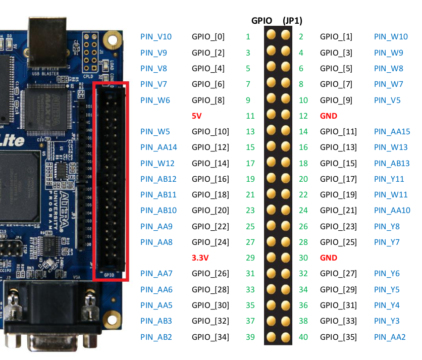

# [IBM PC/XT](https://en.wikipedia.org/wiki/IBM_Personal_Computer_XT)  [DeMiSTified](https://github.com/robinsonb5/DeMiSTify) - de10lite port

31/10/22 de10lite port DeMiSTified by @somhi from original MiSTer PCXT core  https://github.com/spark2k06/PCXT_MiSTer

[Read this guide if you want to know how I DeMiSTified this core](https://github.com/DECAfpga/DECA_board/tree/main/Tutorials/DeMiSTify).

Read the main [Readme](https://github.com/somhi/PCXT_DeMiSTify) also.

### STATUS

* CGA VRAM with 128 kB for all Tandy games.

* **UART port needs to be used to load the OS through the serdrive app.** Load OS using Serial Rx/Tx cable.

**Additional hardware required** (see pinout connections below):

- PS/2 keyboard & mouse connected to GPIO: **I had serious problems with keyboard giving me lots of errors. It was related to GND wiring. Make sure to connect the PS2 GND to the Arduino headers GND.**
- MicroSD card reader connected to GPIO
- Sound interface (I2S or Delta-sigma) connected to GPIO


### Compile the project in Quartus:

Project already has the DeMiSTify firmware already generated so if you have cloned recursively then you can open the project with Quartus:

```sh
git clone  --recursive https://github.com/somhi/PCXT_DeMiSTify

#check comments on top of /de10lite/de10lite_top.vhd in case additional actions are needed

#Load project in Quartus from /de10lite/PCXT_de10lite.qpf
```


### Instructions to compile the project for a specific board:

```sh
git clone https://github.com/somhi/PCXT_DeMiSTify
cd PCXT_DeMiSTify
#Do a first make (will finish in error) but it will download missing submodules 
make
cd DeMiSTify
#Create file site.mk in DeMiSTify folder 
cp site.template site.mk
#Edit site.mk and add your own PATHs to Quartus (Q18)
gedit site.mk
#Go back to root folder and do a make with board target (deca, neptuno, uareloaded, atlas_cyc). If not specified it will compile for all targets.
cd ..
make BOARD=de10lite
#when asked just accept default settings with Enter key
```

After that you can:

* Flash bitstream directly from [command line](https://github.com/DECAfpga/DECA_binaries#flash-bitstream-to-fgpa-with-quartus)
* Load project in Quartus from /de10lite/PCXT_de10lite.qpf

### Pinout connections:

From top file:

```verilog
#PS2 Keyboard
alias ps2_keyboard_clk : std_logic is GPIO(10);
alias ps2_keyboard_dat : std_logic is GPIO(12);
#PS2 Mouse
alias ps2_mouse_clk : std_logic is GPIO(14);
alias ps2_mouse_dat : std_logic is GPIO(16);
#Audio sigma-delta
alias sigma_l : std_logic is GPIO(18);
alias sigma_r : std_logic is GPIO(20);
#UART
ARDUINO_IO(1) <= uart_txd;
uart_rxd <= ARDUINO_IO(0);
ARDUINO_IO(3) <= uart_rts;
uart_cts <= ARDUINO_IO(2);
#SD card
ARDUINO_IO(10)<=sd_cs;
ARDUINO_IO(11)<=sd_mosi;
sd_miso<=ARDUINO_IO(12);
ARDUINO_IO(13)<=sd_clk;
#Composite
ARDUINO_IO(7)  	<= composite_output(0);		--1 PIN
ARDUINO_IO(6)	<= composite_output(1);		--OPTIONAL 2 PIN
#Debug
GPIO(0)<=rs232_txd;
rs232_rxd<=GPIO(1);
```




**Others:**

* Button KEY0 is Reset button
* Button KEY1 is OSD button

### OSD Controls

* F12 show/hide OSD 
* Long F12 toggles VGA/RGB mode
* The user button KEY0 resets the controller (so re-initialises the SD card if it's been changed, reloads any autoboot ROM.) The OSD Reset menu item resets the core itself.
* The user button KEY1 opens the OSD

